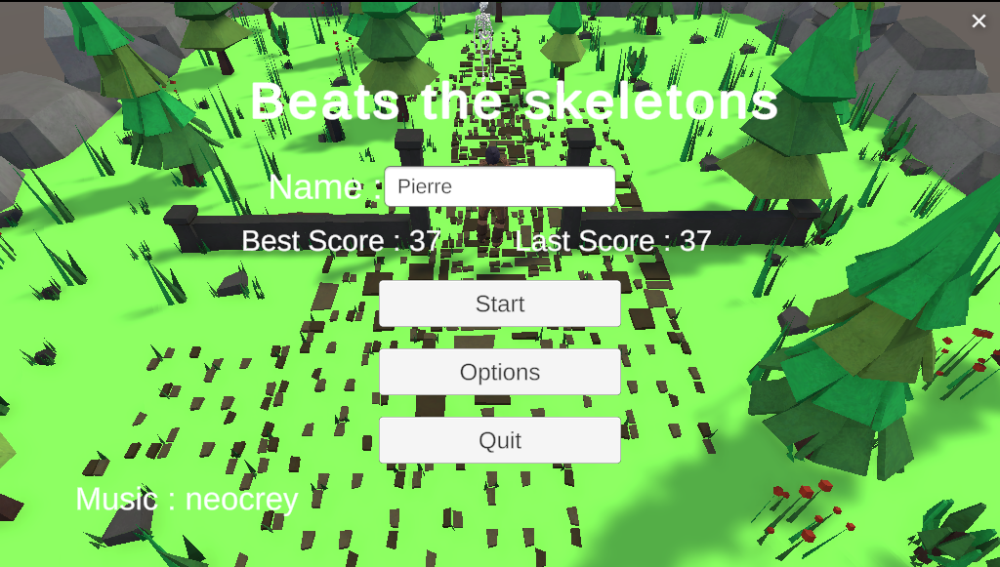
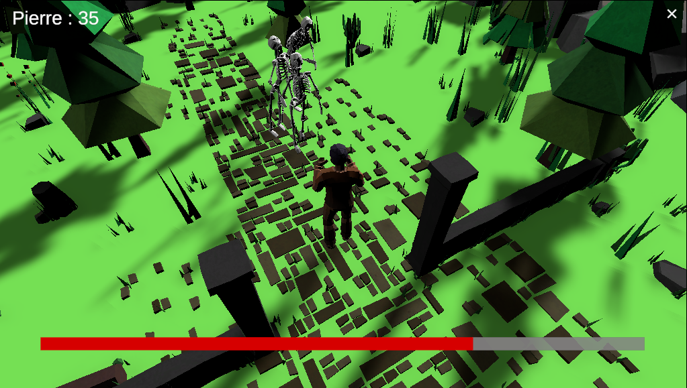
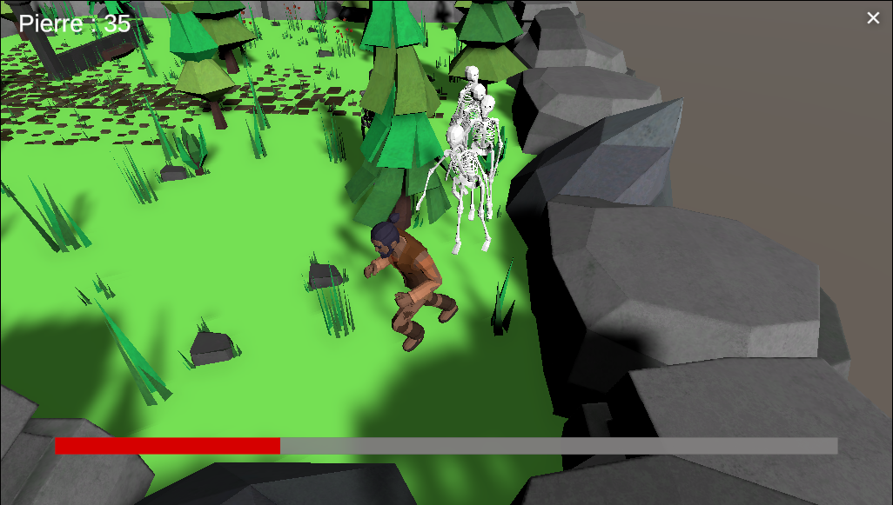
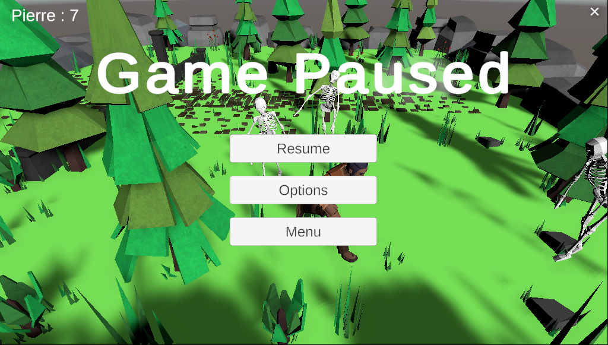
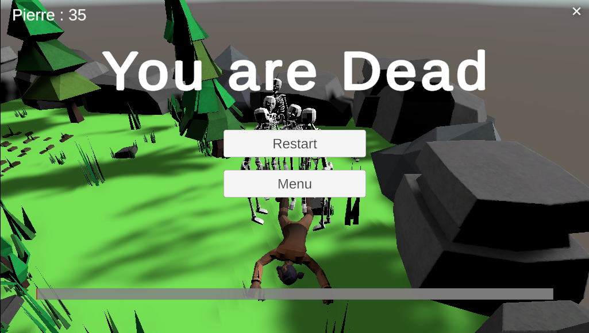

# Beat-the-skeletons
This repository contains the first game I made, here is its history :
During the 2022 winter holidays, I wanted to improve my skills on Unity so I started by following the Unity Learn's Essential and Junior Programmer pathways. 
When they were finished, I wanted to put pretty much everything I'd learnt into a game. I wwanted to do a fighting game, in 3rd view so I followed online tutorials on how to implement that.
When I got a game with a player, some enemies (skeletons), animations for fights I designed the game engine to start new games, make enemies spawns etc.
I then needed to implement an Interface for the game so I created a start menu, and a pause menu. In each one we can change the game parameters (music/effects volumes, difficulty).
I also implement a score system that scores your point soo you can keep your best score over game sessions, you have to register a name to use that.

The game can be played through a browser at this address : https://play.unity.com/mg/other/builds-29-6
It contains some bugs and really needs some improvements to become a real game but the aim wasn't to create the new skyrim but to improve myself on Unity, and it has achieved its purpose.

In conclusion I learned a lot with this mini-project that took me like one week to do. I tackled game managing, UX design, data persistency, animations, particles effect and a lot more.

